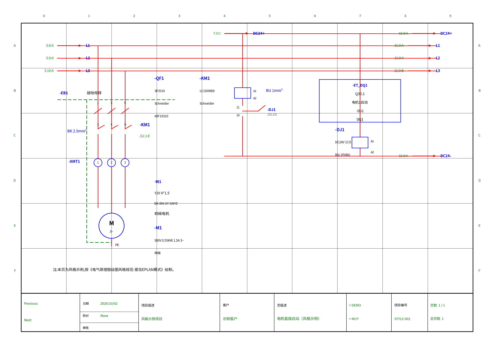

# 电气原理图绘图风格规范（无锡爱信 / EPLAN 模式）

> 从无锡爱信机械科技有限公司 167 页 EPLAN 成套电气原理图（南通瑞翔 8K6&8K7 炉前锂盐投料项目，项目编号 WAXX12819）提炼的绘图风格规范，制定于 2026-10-02。此后所有电气原理图类绘图均按本规范执行。

## 仓库内容

| 文件 | 说明 |
|---|---|
| `docs/电气原理图绘图风格规范-爱信EPLAN模式.md` | 规范全文：总体风格、颜色体系、图框与标题栏、字体、设备代号体系、交叉引用、线色与电缆标注、IO 分配页模式、现场设备功能盒模式、端子图模式、布局图模式、BOM 模式、排版习惯 |
| `aixin_style.py` | matplotlib 可复用样式模块：A3 横幅图框、坐标网格、标题栏、颜色常量、导线 / 交叉引用 / 设备标注 / IO 框等辅助函数 |
| `examples/demo_原理图风格示例页.png` | 按本规范生成的一页示例（电机直接启动回路），PNG 预览 |
| `examples/demo_原理图风格示例页.pdf` | 同一示例页的 PDF 版本，可打印对照 |
| `examples/gen_demo.py` | 示例页生成脚本：运行后重新生成 PNG / PDF（需 `matplotlib` 与 NotoSansSC 字体，`aixin_style.py` 放在仓库根目录） |

## 快速使用

把 `aixin_style.py` 与你的绘图脚本放在同一目录：

```python
import aixin_style

fig, ax = aixin_style.new_fig()
aixin_style.draw_frame(ax)
# ……按规范绘制图面内容……
fig.savefig("输出页.pdf")
```

依赖：`matplotlib`，以及 NotoSansSC（思源黑体）Regular / Bold 字体文件（模块默认从 `~/workspace/fonts/` 读取，可按需修改 `_FONT_DIR`）。

## 示例页预览



## 风格速览

- **彩色绘制**：红导线 / 蓝设备代号与设备框 / 绿交叉引用与坐标网格 / 品红 IO 框
- **A3 横向**：顶部坐标网格（列 0–9 / 行 A–F），底部标题栏
- 设备代号一律 `-` 前缀、蓝色加粗；跨页信号标注格式 `线号 /页.列:行`
- 电气符号按 IEC 60617 绘制（断路器、接触器 / 继电器触点、线圈、电机等）

## 版本历史

所有改版通过本仓库的提交记录（Commits）查看。
